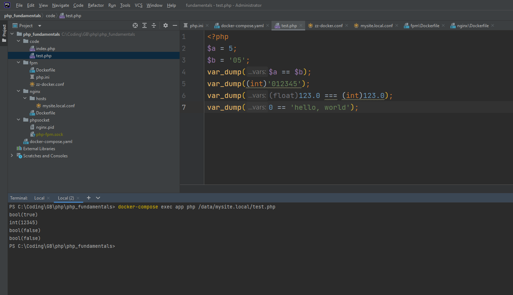
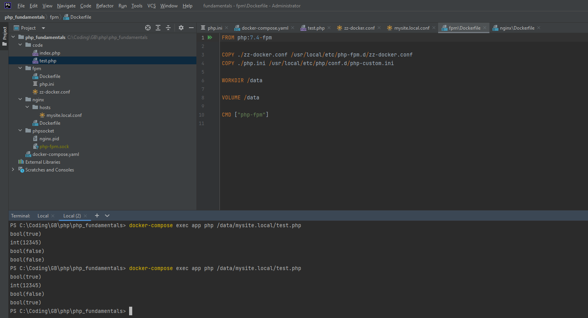

# PHP основы

var_dump($a == $b);
$a имеет значение 5 (целое число)
$b имеет значение '05' (строка)
Оператор == сравнивает значения после приведения их к одному типу. В данном случае строка '05' будет преобразована в число 5, и сравнение будет 5 == 5, что истина.

var_dump((int)'012345');
Строка '012345' будет преобразована в целое число. Префикс 0 в строке указывает на октальное значение в PHP, но в данном случае это просто строка, представляющая число 12345.

var_dump((float)123.0 === (int)123.0);
(float)123.0 преобразует число 123.0 в float
(int)123.0 преобразует число 123.0 в integer
Оператор === проверяет и тип, и значение. Здесь 123.0 как float не равно 123 как int из-за различия в типах.

var_dump(0 == 'hello, world');
В php7.4 Строка 'hello, world' не начинается с числового значения, поэтому она будет приведена к 0. И резултат будет true.
В php8.0 и выше поведение было изменено. Если одно из значений — число, а другое — строка, PHP больше не пытается приводить строку к числу. Строка 'hello, world' не приводится к 0, а сравнивается как строка. Следовательно, 0 (число) не равно 'hello, world' (строка), и результатом будет false.